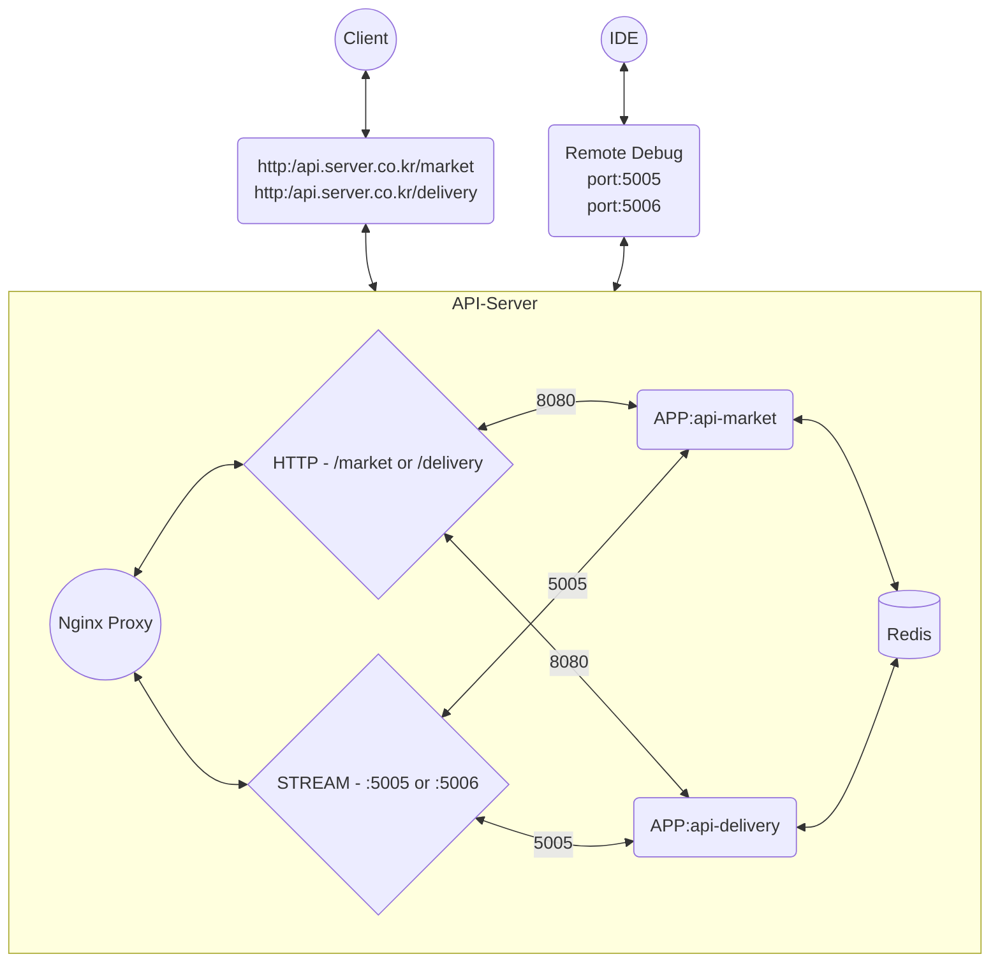

# Practice 1. Docker with Spring Boot

이전에 정리한 [Docker Compose 작성하기](docker-docker-compose-about.md) 내용을 바탕으로 Docker Compose를 작성하는 실습을 해보겠습니다.

실습할 프로젝트는 자바17, 스프링 부트 3.1.5 버전과 gradle 8.4 버전을 사용하였고 기본적으로 멀티 모듈로 구성하였습니다.

`[ Practice 1. Docker with Spring Boot ]`에서는 어떻게 애플리케이션을 구성하고 프로젝트 초기 설정을 하는지 살펴보고 다음 
`[ Practice 2. Docker with Spring Boot ]`에서 자세한 docker compose 작성 방법을 살펴보겠습니다.   

## 1. 스프링 부트 프로젝트 멀티 모듈 구성하기

멀티 모듈 구성과 관리는 ['buildSrc' 방식](https://docs.gradle.org/current/userguide/declaring_dependencies_between_subprojects.html)
으로 빌드 스크립트 컨벤션을 작성하여 모듈을 구성했습니다.

```text
{project}
├── buildSrc
│   ├── src
│   │   └── main
│   │       └── java
│   │           └── base.java-conventions.gradle
│   └── build.gradle
├── api-delivery [module]
│   ├── src
│   │   └──...
│   └── build.gradle
├── api-market   [module]
│   ├── src
│   │   └──...
│   └── build.gradle
└── settings.gradle
```

자세한 구조는 [깃허브 저장소](https://github.com/ummha/Practice.Docker/tree/main)에서 확인할 수 있습니다.

## 2. 애플리케이션 구성도



## 3. 초기 Host 설정

목적에 맞게 애플리케이션에 접근하기 위해서 호스트 파일을 작성해줍니다. 

본 실습에서는 프록시 방식을 Path(또는 Location)으로 구분하여 `/market` 으로 HTTP 요청이 들어오면 `api-market` 컨테이너로 포워딩해주고 
`/delivery` 로 HTTP 요청이 들어오면 `api-delivery` 컨테이너로 포워딩합니다. 

- host 파일 위치 : `/private/etc/hosts` (MAC)
```Text
##
# Host Database
#
# localhost is used to configure the loopback interface
# when the system is booting.  Do not change this entry.
##
127.0.0.1       api.server.co.kr
...
```

## 5. Spring Boot 프로젝트 초기 설정

build 설정부터 간단한 애플리케이션 컨트롤러를 작성합니다.

### build.gradle

그래들 플러그인으로부터 스프링 부트 프로젝트 3.1.5 버전을 설정합니다.

{style="narrow" sorted="desc"}
위치
: `buildSrc/build.gradle`

```Groovy
plugins {
    id 'groovy-gradle-plugin'
}

repositories {
    gradlePluginPortal()
    mavenCentral()
}

dependencies {
    implementation 'org.springframework.boot:spring-boot-gradle-plugin:3.1.5'
}
```

### base.java-conventions.gradle

각 모듈 별로 기본적으로 사용될 빌드 스크립트를 작성합니다. 

{style="narrow" sorted="desc"}
위치
: `buildSrc/src/main/java/base.java-conventions.gradle`

```Groovy
plugins {
    id 'java-library'
    id 'org.springframework.boot'
    id 'io.spring.dependency-management'
}

group = 'com.practice'
version = '0.0.1-SNAPSHOT'

java {
    sourceCompatibility = '17'
}

configurations {
    compileOnly {
        extendsFrom annotationProcessor
    }
}

repositories {
    mavenCentral()
}

sourceSets {
    main {
        resources {
            srcDirs = ["src/main/resources"]
        }
    }
}

dependencies {
    implementation 'org.springframework.boot:spring-boot-starter-thymeleaf'
    implementation 'org.springframework.boot:spring-boot-starter-web'
    implementation 'org.springframework.boot:spring-boot-starter-data-redis'
    implementation 'org.springframework.session:spring-session-data-redis'

    compileOnly 'org.projectlombok:lombok'
    developmentOnly 'org.springframework.boot:spring-boot-devtools'
//    developmentOnly 'org.springframework.boot:spring-boot-docker-compose'
    annotationProcessor 'org.springframework.boot:spring-boot-configuration-processor'
    annotationProcessor 'org.projectlombok:lombok'
    testImplementation 'org.springframework.boot:spring-boot-starter-test'
}

tasks.named('test') {
    useJUnitPlatform()
}
```

> 위 주석 처리된 spring-boot-docker-compose 의존성은 스프링 부트 3.1 부터 추가된 스프링 부트 프로젝트에서 제공하는 Docker Compose Support 입니다.
>
> Spring Boot Docker Compose Support 프로젝트는 도커 기반의 스프링 부트 프로젝트를 보다 편리하게 연동하여 개발하고 빌드할 수 있도록 서포트해주는
> 일종의 스프링 도커 개발 도구 입니다. 본 실습에서는 호환이 되지않아 다른 실습에서 Docker Compose Support 를 다시 살펴보겠습니다.
>
> [Docker Compose Support in Spring Boot 3.1](https://spring.io/blog/2023/06/21/docker-compose-support-in-spring-boot-3-1)
> 
{ style="note" }

### 각 모듈 별 build.gradle {id="each-modules-build.gradle"}

각 모듈 별로 모든 런타임 클래스 경로들을 볼륨의 특정 디렉토리로 복사하는 태스크를 작성합니다. 

{style="narrow"}
위치
: 
- `api-delivery/build.gradle`
- `api-market/build.gradle`

```Groovy
# :api-delivery 모듈의 build.gradle

plugins {
    id 'base.java-conventions'
}

dependencies {
}

jar.enabled =false
bootJar.enabled = true

bootJar {
    archiveExtension = 'jar'
    archiveBaseName = 'api-delivery'
}

tasks.register('copyDeps', Copy) {
    dependsOn 'cleanDeps'
    doFirst {
        println "##> Task :api-delivery:copyDeps:START"
    }
    from(sourceSets.main.runtimeClasspath)
    includeEmptyDirs = false
    into('/opt/app/api-delivery/classes/')

    doLast {
        println "##> Task :api-delivery:copyDeps:DONE"
    }
}

tasks.register('cleanDeps', Delete) {
    delete '/opt/app/api-delivery/classes/'
}
```

- `cleanDeps`
  - 해당 태스크가 실행되면 `delete` 구문에 설정된 경로의 모든 파일이 삭제됩니다.
- `copyDeps`
  - 해당 태스크는 `cleanDeps` 태스크와 의존성을 연결하여 `cleanDeps` 태스크가 먼저 실행되도록 하였습니다. 
  - 태스크가 실행되면 `into` 구문에 설정한 경로에 `runtimeClassPath`가 복사됩니다.

> 위 코드는 `api-delivery`의 `build.gradle`에 작성된 내용입니다.
> 
> `api-market`은 거의 대부분 동일하며 복사하는 위치만 다릅니다. 자세한 내용은 [깃허브 저장소](https://github.com/ummha/Practice.Docker/blob/main/api-market/build.gradle)
> 에서 확인가능합니다.

### 각 모듈 별 컨트롤러

각 모듈 별로 컨트롤러를 작성합니다.

컨트롤러에는 해당 모듈에서 응답된 것임을 명확히 알 수 있는 메소드(`GetMapping("")`)와 레디스 세션 공유가 정상적으로 동작하는 것을 확인 할 수 있는 
세션 확인용 메소드들을 추가합니다.

```Java
@Slf4j
@RestController
@RequiredArgsConstructor
public class DeliveryController {
    private final HttpServletRequest servletRequest;

    @GetMapping("")
    String delivery() {
        log.info("REQUEST :: request:url:{}", servletRequest.getRequestURL());
        return "Deliver Soon!";
    }

    @GetMapping("/session")
    ResponseEntity<Map<String, Object>> session() {
        HttpSession httpSession = servletRequest.getSession();

        Map<String, Object> body = new LinkedHashMap<>();
        body.put("id", httpSession.getId());
        body.put("createdBy", httpSession.getAttribute("createdBy"));
        body.put("modifiedBy", httpSession.getAttribute("modifiedBy"));
        return ResponseEntity.ok(body);
    }

    @PutMapping("/session")
    ResponseEntity<Map<String, Object>> updateSession() {
        HttpSession httpSession = servletRequest.getSession();
        if(httpSession.getAttribute("createdBy") == null) {
            httpSession.setAttribute("createdBy", "delivery");
        }
        httpSession.setAttribute("modifiedBy", "delivery");

        Map<String, Object> body = new LinkedHashMap<>();
        body.put("id", httpSession.getId());
        return ResponseEntity.ok(body);
    }

    @PostMapping("/session")
    ResponseEntity<Map<String, Object>> createSession() {
        HttpSession httpSession = servletRequest.getSession();
        httpSession.setAttribute("createdBy", "delivery");
        httpSession.setAttribute("modifiedBy", "delivery");

        Map<String, Object> body = new LinkedHashMap<>();
        body.put("id", httpSession.getId());
        return ResponseEntity.ok(body);
    }
}
```

> 본 실습에서는 편의를 위해 어떠한 DTO 클래스도 사용하지 않았습니다.

### 애플리케이션 실행 클래스

세션 저장소를 레디스로 사용하기 위해 `@EnableRedisHttpSession` 어노테이션을 작성해줍니다.

```Java
// :api-delivery
@EnableRedisHttpSession
@SpringBootApplication
public class DeliveryApplication {
    public static void main(String[] args) {
        SpringApplication.run(DeliveryApplication.class, args);
    }
}
```

```Java
// :api-market
@EnableRedisHttpSession
@SpringBootApplication
public class MarketApplication {
    public static void main(String[] args) {
        SpringApplication.run(MarketApplication.class, args);
    }
}
```

### 애플리케이션 프로퍼티

각 모듈 별로 애플리케이션 프로퍼티를 설정합니다.

```yaml
server:
  servlet:
    context-path: /delivery
    session:
      cookie:
        path: /
spring:
  data:
    redis:
      host: redis
      port: 6379
```

```yaml
server:
  servlet:
    context-path: /market
    session:
      cookie:
        path: /
spring:
  data:
    redis:
      host: redis
      port: 6379
```

- 본 실습에서는 각 애플리케이션이 서로 다른 컨텍스트 경로를 사용하도록 설정하였습니다.
- 쿠키 경로는 `/`로 설정하여 같은 도메인 Host인 경우 세션 아이디를 전달 받을 수 있도록 합니다.

## 마치며

다음 실습에서 docker-compose.yml을 작성하고 각 모듈 별로 Dockerfile을 작성하는 방법을 알아보겠습니다.