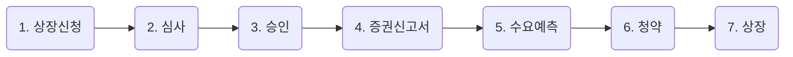

# IPO(기업공개)는 어떤 의미일까?

## IPO(Initial Public Offering)란?

*비상장기업이 외부 투자자가 공개적으로 주식을 살 수 있도록 기업이 자사의 주식과 경영내역을 시장에 공개하는 것을 의미합니다. 즉, 코스피 시장 혹은 코스닥 시장에 들어가기 위해 신고하는 과정이라고 볼 수 있습니다.

> *비상장기업 : 코스피, 코스닥 시장에 등록되지 않은 주식회사

## 기업이 IPO를 하는 이유가 무엇일까? {id="stock-ipo-reason"}

기업은 성장을 하기 위해 자사에 끊임없는 투자를 해야 합니다. 이러한 투자금을 확보하기 위해서는 은행에서 돈을 빌리거나, 채권을 발행하기도 하고 주식시장에 상장된 기업들은 *유상증자 등을 통해 시장에서 자금을 직접
조달하기도 합니다. 비상장기업들도 많은 자금이 필요합니다. 이때 IPO를 하게 되면 대규모 자금을 손쉽게 조달할 수 있고, 이 자금조달을 통해 기업을 성장 시킬 수 있습니다. 또한 기업의 모든 정보가 공개되므로
기업에 대한 신뢰도 향상과 홍보효과도 부수적으로 얻을 수 있습니다.

> *유상증자 : 기업이 자금을 조달하기 위해 주식시장 내에서 투자자들을 대상으로 주식을 발행하는 행위

> IPO는 기업에 있어서는 자금조달, 기업홍보 등의 효과를 낼 수 있는 중요한 이벤트입니다. 투자자들에게는 매력적인 기업에 정식으로 투자할 수 있는 좋은 기회가 될 수 있습니다.
>
{style="note"}

## IPO 과정이 어떻게 될까? {id="stock-ipo-process"}

IPO 과정의 순서는 다음과 같습니다.

### 1. 상장신청 

IPO를 하기 위해 비상장기업은 제일 먼저 증권선물거래소에 상장신청을 해야합니다.

### 2. 심사

증권선물거래소는 상장신청을 한 기업들을 대상으로 심사를 합니다.

### 3. 승인

심사기준을 충족한 기업들에게 승인을 내주고, 기업은 IPO를 위한 본격적인 실무작업에 들어갑니다.

### 4. 증권신고서

심사를 통과한 기업은 주관사(IPO를 도와주는 증권사)와 함께 증권신고서를 작성합니다. 증권신고서는 공모방법, 공모가 결정방법, IPO를 하는 목적, 기업의 재무제표, 주주현황, 기업의 사업현황 등 중요한 정보들이
담겨 있습니다. 신규상장 기업에 투자하는 투자자라면 반드시 읽어봐야하는 자료이며 전자공시(dart.fss.or.kr) 사이트에서 언제든지 증권신고서를 검색해서 찾아볼 수 있습니다.

### 5. 수요예측

증권신고서 제출 후에는 기관투자자들을 대상으로 수요예측을 진행 합니다. 경매와 비슷합니다. 공모가 밴드(해당기업과 주관 증권사가 희망하는 공모가격 밴드를 설정)를 참고해 기관투자자들이 원하는 수량과 가격을
제출합니다. 이를 통해서 수요예측은 기업의 IPO 흥행 성공여부를 알 수 있는 예고편이 될 수 있습니다.

### 6. 청약

수요예측이 끝나고 나면 공모가를 결정하게 됩니다. 보통 경쟁기업들과 비교분석을 해서 기업의 적정가치를 결정하게 되며, 20~30% 정도 할인을 해서 공모가 밴드를 결정하고 기관들의 수요예측을 통해 적정 공모가를
결정하게 됩니다.

공모가가 결정되면 기업의 시가총액이 결정되고, 공모주 청약이 시작됩니다. 공모주 청약은 이틀간 진행되며, 주관 증권사의 계좌가 반드시 있어야 합니다.

### 7. 상장

청약까지 끝나고 나면 일정시간 우에 정식으로 주식시장(코스피 혹은 코스닥)에 상장을 하게 됩니다. 이제 투자자들은 본인이 원할 때 이 기업을 언제든 투자할 수 있게 됩니다.